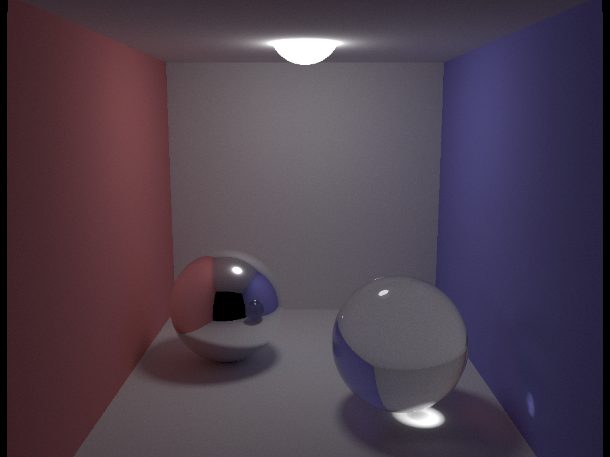

# A portable GPU path Tracer library running powered by SYCL. (OpenCL/CUDA/OpenMP)

### About

This is a GPU path tracer library running on top of SYCL. It aims to be simple, fast, portable, capable of rendering without a GPU, and have minimal dependencies.



##### To compile Tracer, you need:
1. A SYCL implementation. [ComputeCpp CE](https://github.com/codeplaysoftware/computecpp-sdk) is best one available currently so this is what Tracer uses.
2. CMake
3. GoogleTest *(for building tests)*
4. *(Prefered)* A OpenCL accelerated or CUDA device.
    - ComputeCpp will fallback to a cpu based implementation if needed (powered by OpenMP)

##### Tracer's runtime requirements
1. A OpenCL/CUDA runtime
2. Tracer will fallback to OpenMP in the absence of a OpenCL/CUDA runtime.

### Building

While Tracer is a library, a simple main file is used for rendering scene files.  To build Tracer (on GNU/Linux) first download and compile [ComputeCpp CE](https://github.com/codeplaysoftware/computecpp-sdk). Take note of where the root directory of ComputeCpp is, you will need it later.

Now in Tracer's root directory, run:

```bash
mkdir build
cd build
cmake ../ -DComputeCpp_DIR=/home/me/path/to/ComputeCpp-root-dir
make
```

If build succeeded, you will find two exe's in the build directory. `tracer` and `tracer_test`.  The first will render scene files and the second is the tests.

### Rendering a Scene

To render a scene from a scene file. Simply run. *For final renders, I recommend at least 25,000 samples per pixel for a high quality output image.*
```bash
cd build
./tracer /path/to/scenefile.txt samples_per_pixel
```
The rendered scene will output in the current working directory to `scenefile.png`.

###### Rendering with Included Scenes
```
cd scene_files
../build/tracer scene00.txt samples_per_pixel
```

###### Additional rendering options

You can choose to set a different image with and height then what is in the scene file. `forceHostCPU` ignores the GPU and any OpenCL devices and will render using OpenMP.  This is useful for debugging.

```
Usage: ./raytracer scenefile.txt samples_per_pixel [image_width] [image_height] [forceHostCPU]
```
For example, `./raytracer scenefile.txt samples_per_pixel 600 600 1` will render a 600x600 image on the CPU using OpenMP.

### Running the tests

Simply run `tracer_test` after building.

```bash
cd build
./tracer_test
```

### Scene Files

Scene files are text files that setup the scene for rendering.  (Camera, objects, materials, positions, etc.). The following is an example of a very basic scene file.  It renders a single sphere light source in the center of the screen.  Since there are no other objects in the scene, it is not very interesting.

```
# setup camera
eye 50 50 220               # x,y,z of where the camera's eye is located
look 50 50 50               # x,y,z of where the camera is looking
up 0 1 0                    # up for the camera (is the camera upside down?)
d 100                       # the focal length of the camera
bounds -50 -37.5 50 37.5    # the bounds of the image plane (the size, in world coords, of the image)
res 1024 768                # the resolution of the output image

# glowing sphere in the scene
#         x  y  z   r     emitted rgb    color rgb    material type
sphere    50 50 50  10     12 12 12       0 0 0            0
```


**For more example scene files, see the `scene_files` directory.**

Scene files must have all of the following attributes defined Tracer cannot render: `eye`, `look`, `up`, `d`, `bounds`, `res`.

##### Available sphere material types:
0 -> perfect diffuse
1 -> perfect reflection (mirror)
2 -> perfect reflection and refraction (glass)
